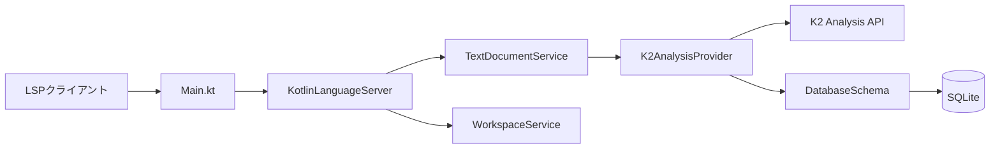
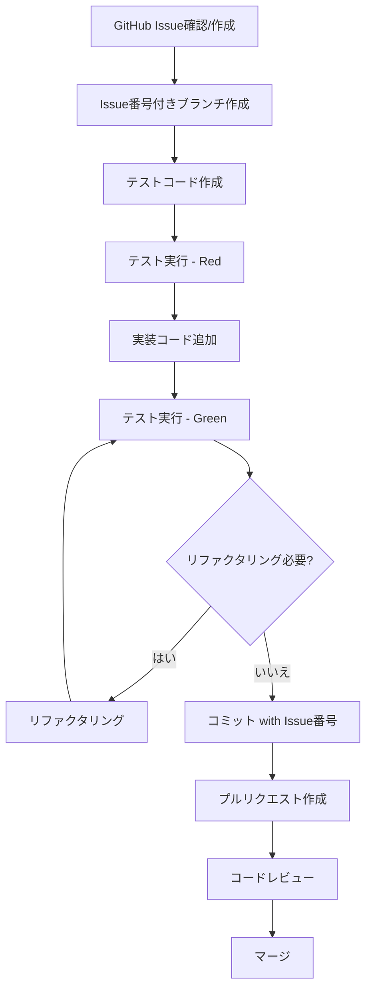

# CLAUDE.md

This file provides guidance for AI assistants (like Claude Code) working on this project.

## プロジェクト概要

このプロジェクトは、**Kotlin 2.0 K2 Analysis API**を活用した高性能Language Serverの実装です。LSP（Language Server Protocol）を通じて、IDEやエディタに対してコード補完、定義ジャンプ、参照検索などの機能を提供します。

### 主要な技術スタック

- **Kotlin 2.0 + K2 Analysis API**: コンパイラの型解析機能を活用
- **JDK 17、Gradle 8+** (Kotlin DSL)
- **LSP4J**: Eclipse LSPフレームワーク（JSON-RPC通信）
- **SQLite**: インデックス/キャッシュ層（WALモード＋FTS5）
- **JUnit 5 + MockK**: テストフレームワーク

---

## よく使用するコマンド

```bash
# ビルド
./gradlew assemble

# テスト実行
./gradlew test

# 特定のテスト実行
./gradlew test --tests <TestClassName>

# ビルド+テスト
./gradlew build

# 開発モードで実行
./gradlew run

# Fat JAR作成
./gradlew shadowJar

# 検証（リント+テスト）
./gradlew verify

# JARから実行
java -Xmx2G -jar build/libs/kotlin-language-server-0.1.0-SNAPSHOT.jar
```

---

## 高レベルアーキテクチャ

### LSPサーバーのアーキテクチャ

- **LSP4JベースのJSON-RPC通信**: stdin/stdoutを使用
- **非同期処理**: スレッドプールによる並行処理設計
- **インクリメンタルなテキスト同期**: 効率的なドキュメント更新

### 5つの主要コンポーネント

1. **`server/`**: エントリーポイントとサーバー初期化
   - `Main.kt`: アプリケーションのエントリーポイント
   - `KotlinLanguageServer.kt`: サーバーのケイパビリティ定義

2. **`lsp/`**: LSPプロトコル実装
   - `KotlinTextDocumentService.kt`: テキストドキュメント関連の機能（補完、ホバー、定義ジャンプなど）
   - `KotlinWorkspaceService.kt`: ワークスペース関連の機能

3. **`analysis/`**: K2 Analysis API統合ポイント（Phase 2で実装予定）
   - `K2AnalysisProvider.kt`: Kotlinコンパイラの型解析機能へのインターフェース

4. **`persistence/`**: SQLiteベースのインデックス/キャッシュ層
   - `DatabaseSchema.kt`: シンボルインデックスのスキーマ定義
   - WALモード＋FTS5によるフルテキスト検索最適化

5. **`utils/`**: LSP型変換ユーティリティ
   - `TextEditUtils.kt`: インクリメンタル更新のためのテキスト編集ユーティリティ

### データフロー



**フローの説明:**

1. LSPクライアント（VS Code、IntelliJなど）がJSON-RPCリクエストを送信
2. `Main.kt`がstdin/stdoutでリクエストを受信
3. `KotlinLanguageServer`がリクエストを適切なサービスにルーティング
4. `TextDocumentService`/`WorkspaceService`が機能を実行
5. `K2AnalysisProvider`がKotlinコンパイラAPIを呼び出して型解析を実行
6. 分析結果を`DatabaseSchema`経由でSQLiteにキャッシュ
7. 結果をクライアントに返却

### 重要な設計判断

- **スレッドセーフな並行設計**: `ConcurrentHashMap`でドキュメント状態を管理
- **インクリメンタル更新サポート**: `TextEditUtils`により差分更新を効率化
- **段階的実装が可能な拡張可能なアーキテクチャ**: フェーズ分けされた開発計画
- **SQLite WALモード＋FTS5**: フルテキスト検索の最適化とパフォーマンス向上

---

## 開発フロー

このプロジェクトは **GitHub Issueベースの開発フロー** と **Test-Driven Development (TDD)** を採用しています。

### 開発プロセスのフロー



### 1. Issue駆動開発

- 新機能や改善は**GitHub Issueから開始**
- Issueは仕様として機能する
- 実装時は**Issue番号をコミットメッセージやコードコメントに含める**
- 重要な設計判断や仕様の詳細をIssueコメントとして残す

### 2. Test-Driven Development (TDD)

- **実装の前にテストを作成**
- 期待する振る舞いをテストコードで明確に定義
- テストが失敗することを確認（**Red**）
- 最小限の実装でテストをパスさせる（**Green**）
- コードをリファクタリング（**Refactor**）
- テストファイルの場所: `src/test/kotlin/com/kotlinls/`

### 3. 実装手順の例

1. GitHub Issueを確認・作成
2. Issue番号付きのブランチを作成（例: `feature/123-add-completion`）
3. テストを作成（`src/test/kotlin/com/kotlinls/lsp/CompletionTest.kt`）
4. テストを実行して失敗を確認（`./gradlew test --tests CompletionTest`）
5. 実装を追加（`src/main/kotlin/com/kotlinls/lsp/...`）
6. テストをパスさせる
7. コミット（メッセージ例: `feat: implement code completion #123`）
8. プルリクエストを作成し、Issue番号を関連付ける

### 4. コミットメッセージとPRタイトルのルール

このプロジェクトでは、**Conventional Commits**に準拠したコミットメッセージとPRタイトルを使用します。

**形式:**
```
<type>[optional scope]: <description>

[optional body]

[optional footer(s)]
```

**主なタイプ:**
- `feat`: 新機能の追加
- `fix`: バグ修正
- `docs`: ドキュメントのみの変更
- `style`: コードの意味に影響しない変更（フォーマット、空白、セミコロンなど）
- `refactor`: バグ修正も機能追加もしないコード変更
- `perf`: パフォーマンス改善
- `test`: テストの追加や修正
- `chore`: ビルドプロセスや補助ツールの変更
- `ci`: CI設定ファイルやスクリプトの変更

**コミットメッセージの例:**
```
feat: add code completion for function parameters
fix: resolve NPE in hover provider
docs: update README with installation instructions
test: add unit tests for TextEditUtils
refactor: extract common logic into utility class
perf: optimize symbol indexing query
chore: update Gradle dependencies
```

**Issue番号の含め方:**
```
feat: implement code completion #123
fix: resolve crash on startup #456
```

**Breaking Changesの場合:**
```
feat!: change API signature for completion provider

BREAKING CHANGE: CompletionProvider now requires additional parameter
```

**PRタイトル:**
- PRタイトルも同じConventional Commits形式を使用
- 例: `feat: add hover support for function declarations #123`
- 複数のコミットを含むPRの場合、主な変更内容を反映したタイトルにする

---

## 重要なファイル

新しい開発者やAIアシスタントが最初に読むべきファイル：

1. **`src/main/kotlin/com/kotlinls/server/KotlinLanguageServer.kt`**
   - サーバーのケイパビリティ定義
   - 初期化処理とサービスの登録

2. **`src/main/kotlin/com/kotlinls/lsp/KotlinTextDocumentService.kt`**
   - LSP機能の実装（補完、ホバー、定義ジャンプなど）
   - クライアントとのメインインターフェース

3. **`src/main/kotlin/com/kotlinls/analysis/K2AnalysisProvider.kt`**
   - K2 Analysis APIへの統合ポイント
   - コンパイラ機能の抽象化層

4. **`src/main/kotlin/com/kotlinls/persistence/DatabaseSchema.kt`**
   - シンボルインデックスのスキーマ定義
   - キャッシュ戦略の理解

---

## パフォーマンス目標

| 機能         | 目標レイテンシ | 優先度   |
| ------------ | -------------- | -------- |
| 補完         | < 100ms        | Critical |
| 定義ジャンプ | < 50ms         | High     |
| 参照検索     | < 200ms        | High     |
| ホバー       | < 50ms         | High     |

これらの目標は、実際のIDEでの使用体験を損なわないために設定されています。

---

## 追加リソース

- **README.md**: プロジェクトの概要と使用方法
- **BUILD_INSTRUCTIONS.md**: 詳細なビルド手順と環境設定
- **GitHub Issues**: 機能リクエスト、バグレポート、実装の進捗

---

このドキュメントは、プロジェクトの「大きな絵」を理解し、効率的に作業を開始するためのガイドです。詳細な実装やAPIリファレンスについては、コードベースとJavadoc/KDocコメントを参照してください。
