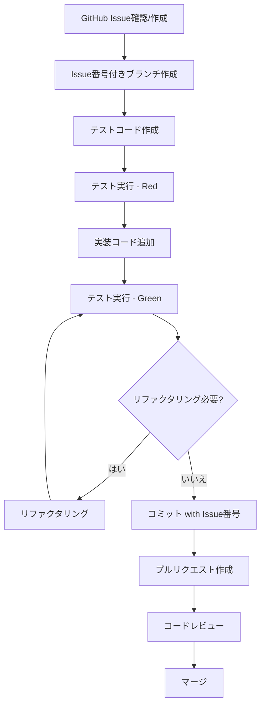

# Contributing to Kotlin Language Server

Thank you for your interest in contributing to the Kotlin Language Server project! This document provides guidelines for contributing to the project.

## 📜 Language Requirements

### English Usage

To ensure accessibility for international contributors and maintain consistency with the open-source ecosystem:

- **Issue titles**: English (required)
- **Issue body and comments**: English (required)
- **Commit messages**: English (required, following Conventional Commits format)
- **Pull request titles**: English (required, following Conventional Commits format)
- **Pull request descriptions**: English (required)
- **Code comments**: English (required)

### Japanese Usage

- **Project documentation**: Japanese is acceptable for `CLAUDE.md` and other internal project documentation
- **Internal discussions**: Team discretion

### Rationale

Using English for issues, PRs, commits, and code ensures:
- **Accessibility**: International contributors can participate without language barriers
- **Consistency**: Aligns with standard practices in the open-source ecosystem
- **Tool integration**: Better compatibility with development tools, CI/CD systems, and automation
- **Long-term maintainability**: Knowledge is preserved in a globally accessible format

---

## 🔄 Development Workflow

このプロジェクトは **GitHub Issueベースの開発フロー** と **Test-Driven Development (TDD)** を採用しています。

### Development Process Flow



---

## 📋 Issue-Driven Development

### 1. Issue Creation and Management

- **Start with an issue**: All new features, enhancements, and bug fixes should begin with a GitHub Issue
- **Issues as specifications**: Issues serve as the specification and design document
- **Reference issue numbers**: Include issue numbers in commit messages and code comments (e.g., `#123`)
- **Document decisions**: Record important design decisions and specification details in issue comments

### 2. Issue Guidelines

When creating an issue:

1. **Use a descriptive title** (in English)
2. **Provide context** in the issue body:
   - Problem description or feature request
   - Expected behavior
   - Actual behavior (for bugs)
   - Steps to reproduce (for bugs)
   - Proposed solution (if applicable)
3. **Use appropriate labels**: `bug`, `enhancement`, `feature`, `documentation`, etc.
4. **Assign to a milestone** if applicable

---

## 🧪 Test-Driven Development (TDD)

### TDD Principles

We follow the **Red-Green-Refactor** cycle:

1. **Red**: Write a test that fails
2. **Green**: Write minimal code to make the test pass
3. **Refactor**: Improve the code while keeping tests passing

### TDD Workflow

1. **Write tests first**: Before implementing any feature, write tests that define the expected behavior
2. **Run and verify failure**: Ensure the test fails initially (Red phase)
3. **Implement the feature**: Write the minimum code needed to pass the test (Green phase)
4. **Refactor**: Clean up the code while ensuring tests still pass (Refactor phase)
5. **Commit**: Once tests pass and code is refactored, commit your changes

### Test File Location

- Test files are located in: `src/test/kotlin/com/kotlinls/`
- Mirror the structure of main source files
- Use the same package structure as the code being tested

### Running Tests

```bash
# Run all tests
./gradlew test

# Run specific test class
./gradlew test --tests <TestClassName>

# Run tests with verbose output
./gradlew test --info
```

---

## 📝 Commit Message and PR Title Conventions

This project follows the **Conventional Commits** specification.

### Format

```
<type>[optional scope]: <description>

[optional body]

[optional footer(s)]
```

### Types

- `feat`: A new feature
- `fix`: A bug fix
- `docs`: Documentation only changes
- `style`: Code style changes (formatting, whitespace, etc.) that don't affect code meaning
- `refactor`: Code changes that neither fix a bug nor add a feature
- `perf`: Performance improvements
- `test`: Adding or updating tests
- `chore`: Changes to build process or auxiliary tools
- `ci`: Changes to CI configuration files and scripts

### Examples

**Basic commit messages:**

```
feat: add code completion for function parameters
fix: resolve NPE in hover provider
docs: update README with installation instructions
test: add unit tests for TextEditUtils
refactor: extract common logic into utility class
perf: optimize symbol indexing query
chore: update Gradle dependencies
```

**With issue numbers:**

```
feat: implement code completion #123
fix: resolve crash on startup #456
docs: add contribution guidelines #789
```

**With scope:**

```
feat(lsp): add signature help support
fix(analysis): resolve type inference error
test(server): add integration tests for initialization
```

**Breaking changes:**

```
feat!: change API signature for completion provider

BREAKING CHANGE: CompletionProvider now requires additional parameter for context
```

**With detailed body:**

```
feat: implement incremental text synchronization

Add support for incremental document updates to improve performance
and reduce memory usage when editing large files.

Closes #123
```

### Pull Request Titles

- PR titles **must** follow the same Conventional Commits format
- Examples:
  - `feat: add hover support for function declarations #123`
  - `fix: resolve memory leak in workspace indexing #456`
  - `docs: update architecture documentation #789`
- For PRs with multiple commits, the title should reflect the primary change
- Link the PR to the related issue using keywords like `Closes #123` or `Fixes #456` in the PR description

---

## 🔨 Implementation Example

Here's a complete example of the development workflow:

### Step 1: Create or Find an Issue

- Check existing issues or create a new one
- Example: Issue #123 "Add code completion support"

### Step 2: Create a Feature Branch

```bash
git checkout -b feature/123-add-completion
```

### Step 3: Write Tests

Create `src/test/kotlin/com/kotlinls/lsp/CompletionTest.kt`:

```kotlin
class CompletionTest {
    @Test
    fun `should provide completion for local variables`() {
        // Arrange
        val document = """
            fun main() {
                val myVariable = 42
                my|
            }
        """.trimIndent()

        // Act
        val completions = provider.complete(document)

        // Assert
        assertTrue(completions.any { it.label == "myVariable" })
    }
}
```

### Step 4: Run Tests (Verify Failure)

```bash
./gradlew test --tests CompletionTest
# Expected: Test fails (Red)
```

### Step 5: Implement the Feature

Add implementation in `src/main/kotlin/com/kotlinls/lsp/...`

### Step 6: Run Tests (Verify Success)

```bash
./gradlew test --tests CompletionTest
# Expected: Test passes (Green)
```

### Step 7: Refactor if Needed

Clean up the code while ensuring tests still pass.

### Step 8: Commit Changes

```bash
git add .
git commit -m "feat: implement code completion for local variables #123"
```

### Step 9: Push and Create PR

```bash
git push origin feature/123-add-completion
```

Create a pull request with:
- **Title**: `feat: implement code completion for local variables #123`
- **Description**: Reference the issue and describe the implementation
- **Link**: Include `Closes #123` in the PR description

---

## 🔍 Code Review Guidelines

### For Contributors

- Ensure all tests pass before requesting review
- Write clear PR descriptions
- Respond to review comments promptly
- Update your PR based on feedback

### For Reviewers

- Check test coverage
- Verify code follows project conventions
- Ensure documentation is updated
- Test the changes locally if needed

---

## 📚 Additional Resources

- [Conventional Commits](https://www.conventionalcommits.org/)
- [Test-Driven Development](https://en.wikipedia.org/wiki/Test-driven_development)
- [GitHub Flow](https://guides.github.com/introduction/flow/)

---

## ❓ Questions?

If you have questions about contributing, feel free to:
- Open a discussion on GitHub
- Comment on relevant issues
- Reach out to the maintainers

Thank you for contributing! 🎉
